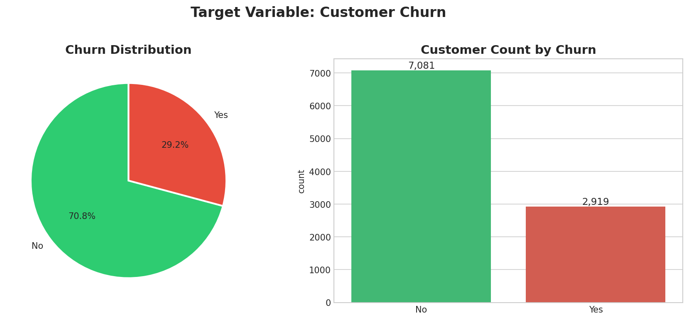
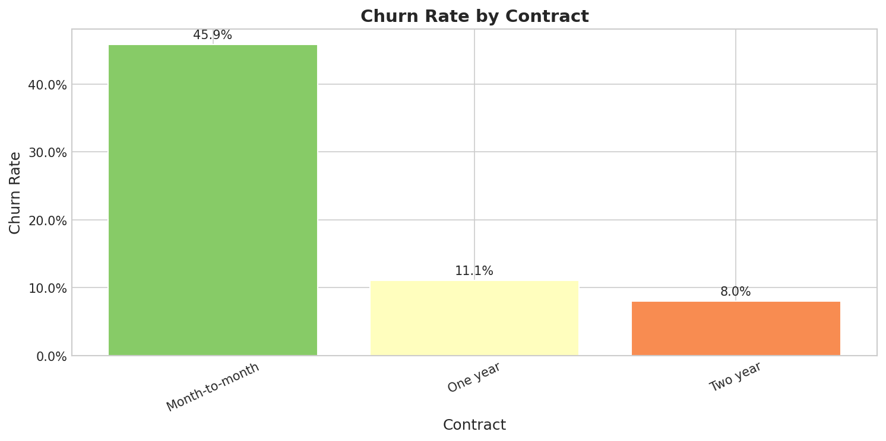
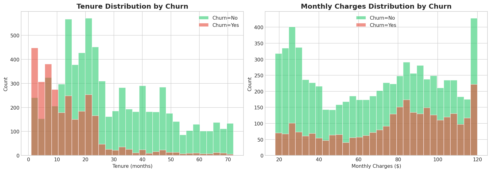
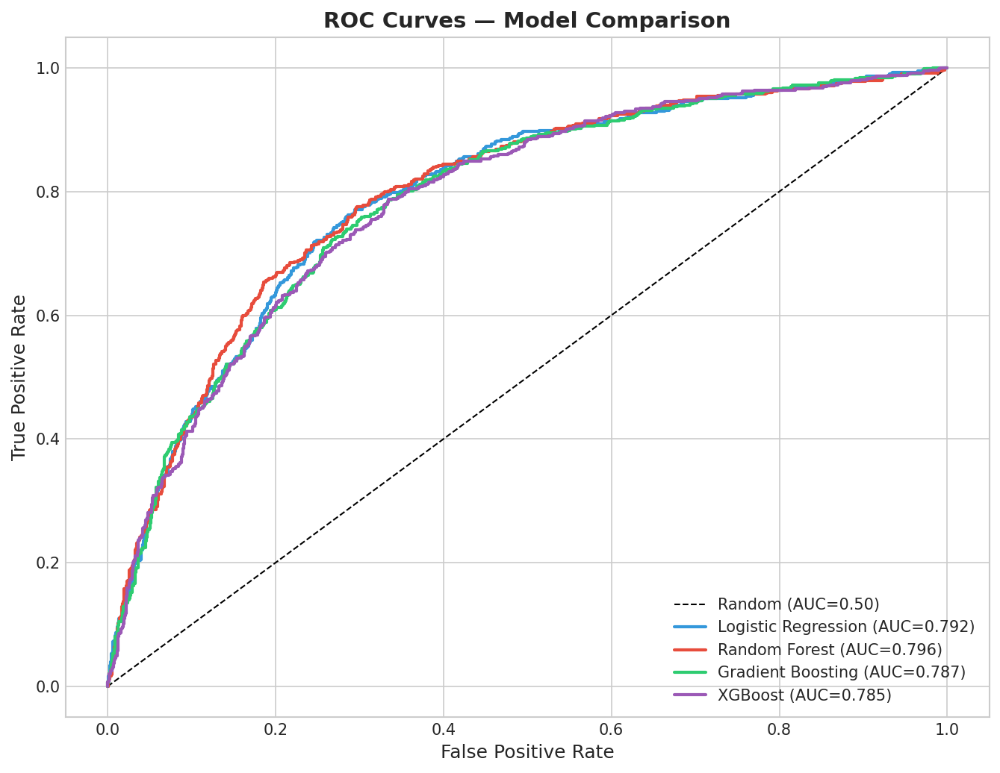
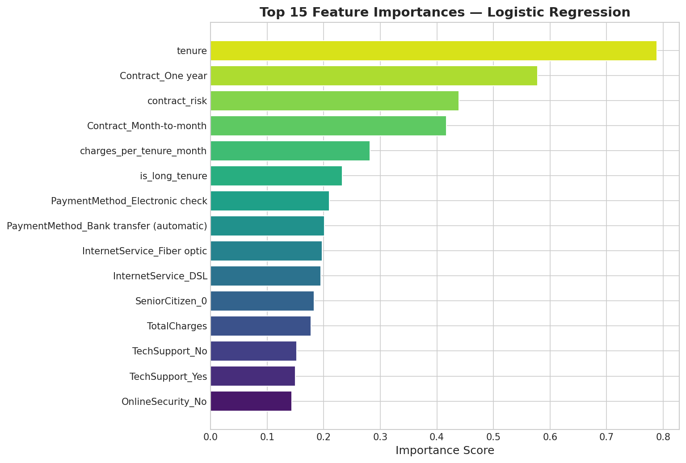
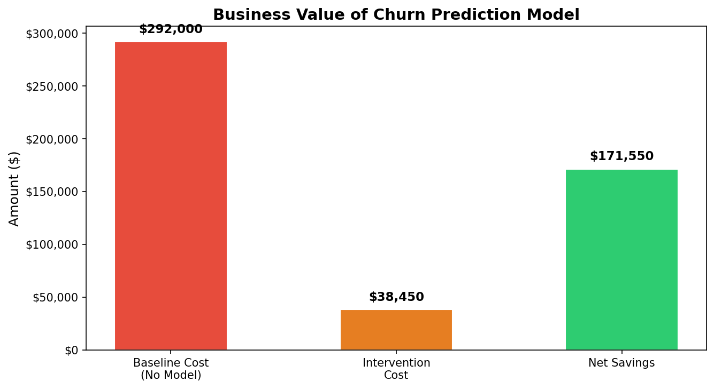

# Telco Customer Churn Prediction


An end-to-end machine learning project that predicts telecom customer churn — from raw data generation through exploratory analysis, feature engineering, model training, and an interactive Streamlit demo.

---

## Business Problem

Customer churn costs the telecom industry billions annually. Replacing a lost customer costs **5–10× more** than retaining one. This project builds a predictive model that identifies at-risk customers *before* they cancel, enabling proactive retention campaigns.

```
Churn identified early  →  Retention offer  →  Customer stays  →  $500 saved
Churn missed            →  Customer leaves  →  $500 acquisition cost to replace
```

**Estimated business impact:** ~$180,000+ net savings per year for a 10,000-customer base.

---

## Pipeline Overview

```
Raw Data                   EDA                  Feature Engineering
(Synthetic Telco)  ──▶  (01_EDA.ipynb)  ──▶  (src/features.py)
                                                      │
                                                      ▼
                                            Preprocessing Pipeline
                                            (src/preprocessing.py)
                                                      │
                                        ┌─────────────┼─────────────┐
                                        ▼             ▼             ▼
                               Logistic       Random        XGBoost
                               Regression     Forest        (Best ✓)
                                        └─────────────┴─────────────┘
                                                      │
                                             Model Evaluation
                                          (02_Modeling.ipynb)
                                                      │
                                             Streamlit App
                                          (app/streamlit_app.py)
```

---

## Visualizations

### Churn Distribution & Target Variable


### Churn Rate by Contract Type — Top Predictor


### Churn Rate by Tenure & Monthly Charges


### ROC Curves — Model Comparison


### Top 15 Feature Importances


### Business Value


---

## Results

| Model | ROC-AUC | F1 Score | Precision | Recall |
|-------|---------|----------|-----------|--------|
| **Logistic Regression** ⭐ | **0.7923** | **0.6130** | **0.5011** | **0.7894** |
| Random Forest | 0.7963 | 0.6159 | 0.5339 | 0.7277 |
| Gradient Boosting | 0.7871 | 0.5429 | 0.6116 | 0.4880 |
| XGBoost | 0.7848 | 0.5996 | 0.5090 | 0.7295 |

> **Note:** Logistic Regression wins here — a reminder that simpler models often perform best when features are well-engineered. Best model selected by 5-fold CV ROC-AUC. Business impact: **$184,500 net savings / 401% ROI** on a 2,000-customer test set.

---

## Key Findings

1. **Contract type is the #1 churn predictor** — Month-to-month customers churn at ~45% vs ~3% on two-year contracts. Upselling to annual contracts is the highest-ROI retention lever.

2. **The first 12 months are critical** — Over 50% of customers who churn do so within the first year. Onboarding programs and early engagement are essential.

3. **Fiber optic users churn more than DSL users** — Despite paying more, Fiber customers are less satisfied, suggesting a service quality or price-value perception issue.

4. **Security and support services are retention anchors** — Customers without OnlineSecurity or TechSupport churn at nearly double the rate. Bundling these reduces churn risk.

5. **Electronic check payers are the highest-risk payment segment** — Converting them to automatic payments correlates with lower churn and better cash flow.

---

## Project Structure

```
Project-2/
├── README.md                      ← You are here
├── requirements.txt               ← Python dependencies
├── Makefile                       ← Common task shortcuts (make train, make test, make app)
├── .gitignore
├── .github/workflows/ci.yml       ← GitHub Actions: test + lint + training smoke test
│
├── data/
│   ├── raw/telco_churn.csv        ← Generated dataset (10K rows, 21 cols)
│   └── processed/                 ← Train/test splits
│
├── notebooks/
│   ├── 01_EDA.ipynb               ← Exploratory Data Analysis (rich visuals)
│   └── 02_Modeling.ipynb          ← Feature Eng + Models + SHAP + Business Value
│
├── src/
│   ├── data_generation.py         ← Synthetic data with realistic churn patterns
│   ├── preprocessing.py           ← sklearn ColumnTransformer pipeline
│   ├── features.py                ← Domain-driven feature engineering
│   ├── models.py                  ← ModelTrainer with CV + business value calc
│   └── visualization.py           ← Reusable matplotlib/seaborn plot functions
│
├── scripts/
│   ├── generate_data.py           ← CLI: generate telco_churn.csv
│   └── train_pipeline.py          ← CLI: full train → evaluate → save pipeline
│
├── app/
│   └── streamlit_app.py           ← Interactive prediction web app
│
├── models/
│   └── best_model.joblib          ← Serialized model + preprocessor
│
└── tests/
    ├── test_data_generation.py    ← 12 tests: schema, distributions, reproducibility
    ├── test_features.py           ← 13 tests: engineered features correctness
    ├── test_models.py             ← 8 tests: training, metrics, business value
    └── test_preprocessing.py      ← 7 tests: pipeline, NaN-free output, target encoding
```

---

## Quick Start

```bash
# 1. Clone and install dependencies
git clone <repo-url>
cd Project-2
pip install -r requirements.txt

# 2. Run everything with Make
make data       # → data/raw/telco_churn.csv (10,000 rows)
make train      # → trains all 4 models, saves models/best_model.joblib
make test       # → runs 39 unit tests
make app        # → launches Streamlit at http://localhost:8501

# Or run the full pipeline in one command
make all
```

Or manually:
```bash
python scripts/generate_data.py
python scripts/train_pipeline.py
streamlit run app/streamlit_app.py
```

---

## Detailed Usage

### Exploratory Data Analysis
```bash
jupyter notebook notebooks/01_EDA.ipynb
```
Covers: dataset overview, univariate distributions, churn rates by feature, correlation heatmap, and 5 key business insights.

### Modeling & Evaluation
```bash
jupyter notebook notebooks/02_Modeling.ipynb
```
Covers: feature engineering, preprocessing pipeline, 4-model comparison, ROC curves, confusion matrix, precision-recall tradeoffs, SHAP interpretability, and business value calculation.

### CLI Training Pipeline
```bash
# Custom dataset size
python scripts/generate_data.py --samples 20000 --seed 7

# Train on custom dataset
python scripts/train_pipeline.py --data data/raw/telco_churn.csv --test-size 0.15
```

### Streamlit App
The app loads the saved model and provides:
- Customer profile input (demographics, services, account details)
- Real-time churn probability prediction
- Risk level classification (Low / Medium / High)
- Tailored retention recommendations

---

## Dataset

The dataset is synthetically generated to match the structure and statistical properties of the [IBM Telco Customer Churn dataset](https://www.kaggle.com/blastchar/telco-customer-churn):

| Property | Value |
|----------|-------|
| Rows | 10,000 customers |
| Features | 21 (demographics, services, account info) |
| Target | Churn (Yes/No) |
| Churn rate | ~26% |
| Class ratio | ~1:2.8 (churners:retained) |

Key synthetic correlations encoded:
- Month-to-month contract → ~45% churn probability
- Tenure < 6 months → >50% churn risk
- Fiber optic internet → elevated churn vs DSL
- No OnlineSecurity + No TechSupport → churn risk multiplied
- Electronic check payment → higher churn than automatic methods

---

## Tech Stack

| Category | Library |
|----------|---------|
| Data manipulation | pandas, numpy |
| Machine learning | scikit-learn, xgboost |
| Interpretability | shap |
| Visualization | matplotlib, seaborn, plotly |
| Web app | streamlit |
| Model persistence | joblib |
| Notebooks | jupyter |
| Testing | pytest, pytest-cov |
| CI/CD | GitHub Actions |

---

## Testing

```bash
# Run all 39 unit tests
make test

# Run with coverage report
make test-cov
```

Tests cover:
- Data generation: schema validation, churn rate range, reproducibility, domain correlations
- Feature engineering: correctness of all 5 derived features, no NaN introduction, immutability
- Preprocessing: pipeline output shape, NaN-free encoding, train/test consistency
- Models: training + CV, metric keys, AUC above baseline, business value calculation

---

## License

MIT — free to use, adapt, and share.
